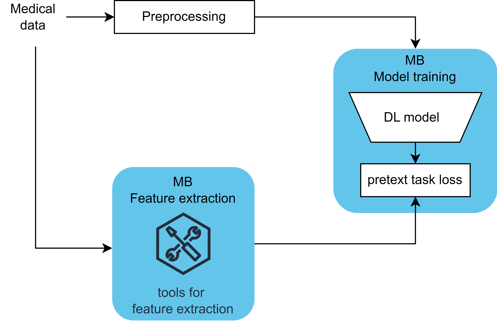
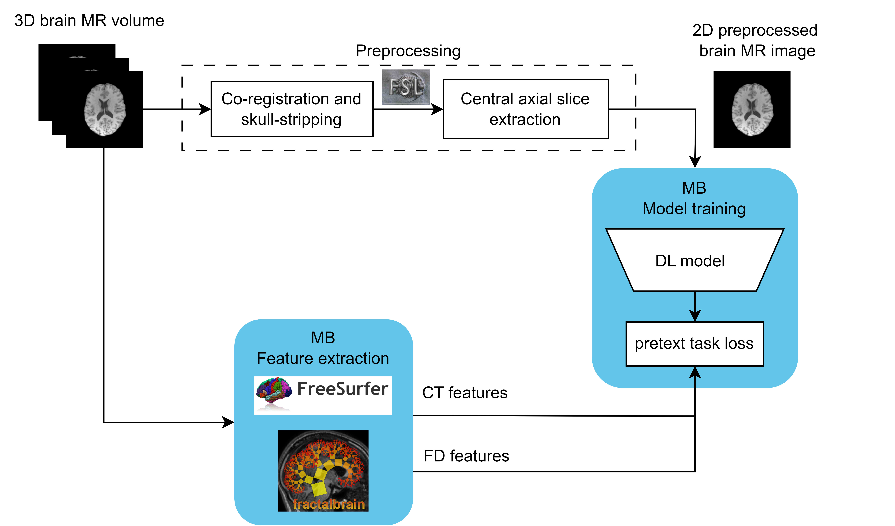

# MedBooster

[MedBooster paper](...). The idea is very simple: teach the model the anatomy of the organ (pretraining) before teaching the model to do diagnosis (fine-tuning). 

This repository provides scripts for pre-training and fine-tuning models for medical image analysis with different learning paradigms.
Currently the repo supports pretraining [ResNet](https://arxiv.org/abs/1512.03385) with [Supervised Learning](https://arxiv.org/abs/1512.03385) and [VICReg](https://arxiv.org/abs/2105.04906) or MedBooster [...] learning paradigms and [BeiT](https://arxiv.org/abs/2106.08254) with [SimMIM](https://ieeexplore.ieee.org/document/9880205) paradigm. The repo is thought to be easily scalable to include different architectures, learning paradigms, data augmentations and losses. 

MedBooster is a general framework for designing Self-supervised learning (SSL) paradigms to pretrain Deep Learning models for medical tasks as explained here [...], briefly schematized in [Figure 1](MedBooster_schema/MedBooster.png) for any medical application, and in [Figure 2](MedBooster_schema/MedBooster_neuroimaging.png) for the specific version implemented in this repo for neuroimaging data.

### Figure 1: General MedBooster Schema


### Figure 2: MedBooster Schema for Neuroimaging


You can run the scripts either using Docker or directly with the provided bash script.

## Table of Contents

- [Setup](#setup)
  - [Using Docker](#using-docker)
  - [Using the Bash Script](#using-the-bash-script)
- [Usage](#usage)
  - [Running with Docker](#running-with-docker)
  - [Running with the Bash Script](#running-with-the-bash-script)

## Setup

### Using Docker

1. **Clone the Repository**:
    ```bash
    git clone <repository-url>
    cd <repository-directory>
    ```

2. **Build the Docker Image**:
    ```bash
    docker build -t med_booster_public .
    ```

### Using the Bash Script

1. **Clone the Repository**:
    ```bash
    git clone <repository-url>
    cd <repository-directory>
    ```

2. **Create and Activate the Conda Environment**:
    ```bash
    conda env create -f environment.yml
    conda activate med_booster
    ```

## Usage

### Running with Docker

1. **Prepare Your Data**:
    Ensure your imaging and tabular data are in the correct paths of your host machine. As explained in the paper [...] if you want to pretrain the model with MedBooster, then the tabular data must contain the features that are desired to be regressed (e.g., cortical thickness and fractal dimension). 

2. **Run the Docker Container**:
    ```bash
    docker run --rm --gpus all \
        --shm-size=8g \
        -e images_dir="/app/data/imaging_file.gz" \
        -e tabular_dir="/app/data/tabular_file.csv" \
        -e EXPERIMENT_FOLDER_NAME="/app/exp_folder/" \
        -v /path/to/data:/app/data \
        -v /path/to/exp_folder:/app/exp_folder \
        med_booster_public
    ```

    Replace the paths in the `-e` and `-v` options with the appropriate paths of your host machine.

### Running with the Bash Script
    ```bash
    images_dir='/path/to/image/data/imaging_file.gz' \
    tabular_dir='/path/to/image/data/tabular_file.csv' \
    EXPERIMENT_FOLDER_NAME='/path/to/exp/exp_folder' \
    bash /MAIN/run_example.sh
    ```

    Replace the paths in the environment variables with the appropriate paths of your host machine.

## Notes

- Ensure that the paths to your data and experiment directories are correctly specified.
- Adjust the shared memory size (`--shm-size`) if necessary, based on your system's capabilities and the dataset size.

## Troubleshooting

- **GPU Not Found**: Ensure NVIDIA drivers and CUDA toolkit are correctly installed on your host machine.
- **Insufficient Shared Memory**: Increase the `--shm-size` parameter when running the Docker container.

## License

This project includes code from the following sources, licensed under the MIT License:

- [Microsoft GitHub Repository](https://github.com/microsoft/SimMIM): Code for SimMIM.
- [Facebookresearch GitHub Repository](https://github.com/facebookresearch/vicreg): Code for VICReg.

The full license text can be found in the `LICENSE` file.

This project is licensed under the MIT License - see the [LICENSE](LICENSE) file for details.

