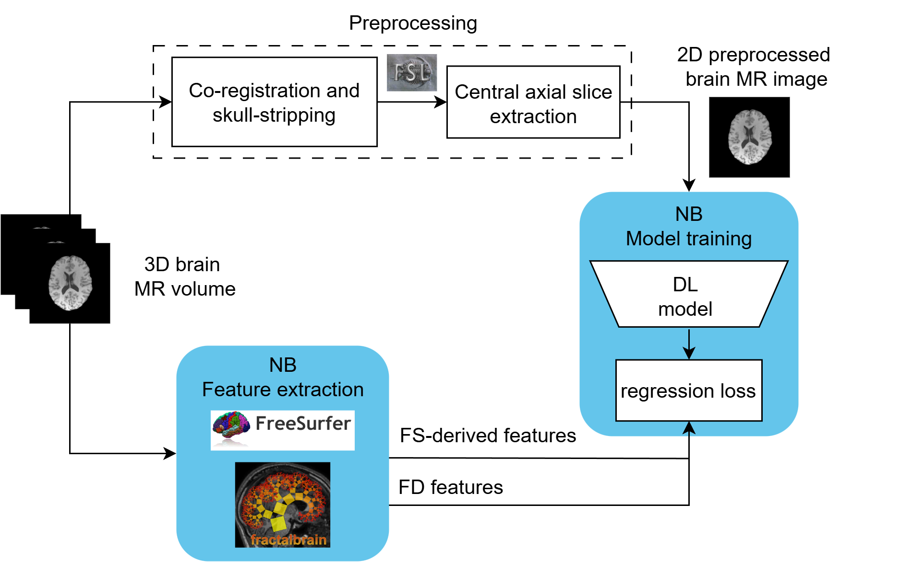

# NeuroBooster

[NeuroBooster paper](...). NeuroBooster (NB) is a novel self-supervised learning (SSL) paradigm tailored for brain MRI analysis, which stands out by not requiring multiple patient views, meta-data, contrastive objectives, or masked image modeling. The core idea of NeuroBooster is very simple: first, pretrain the model to understand brain anatomy by regressing morphological features extracted using open-source brain MRI analysis tools; then, fine-tune the model for downstream diagnostic tasks. A simplified overview is shown in in [Figure 1](readme_images/NeuroBooster.png).

### Figure 1: NeuroBooster Schema


Currently the repo supports pretraining [ResNet](https://arxiv.org/abs/1512.03385) and [ViT](https://arxiv.org/abs/2010.11929) backbones with Neurobooster (our proposed paradigm),  [Supervised Learning](https://arxiv.org/abs/1512.03385), [SimCLR](https://arxiv.org/abs/2002.05709), [VICReg](https://arxiv.org/abs/2105.04906), [MaskedAE](https://arxiv.org/abs/2111.06377). The repo is thought to be easily scalable to include different architectures, learning paradigms, data augmentations, datasets and losses. 

### Figure 2: Saliency maps

[Figure 2](readme_images/saliency_comparison_with_similarity.png) is a comparison of the average saliency maps obtained from the ViT models pretrained with the different paradigms. Check the paper for more details [...]. NeuroBooster (NB) saliency maps are the most similar to the ones obtained with SL.


## Table of Contents
You can run the scripts either using Docker or directly with the provided bash script:

- [Setup](#setup)
  - [Using Docker](#using-docker)
  - [Using the Bash Script](#using-the-bash-script)
- [Usage](#usage)
  - [Running with Docker](#running-with-docker)
  - [Running with the Bash Script](#running-with-the-bash-script)

## Setup

1. **Clone the Repository**:
    ```bash
    git clone https://github.com/aiformedresearch/NeuroBooster.git
    cd <repository-directory>
    ```

### Using Docker 🐳

2. **Build the Docker Image**:
    ```bash
    docker build -t neurobooster_public .
    ```

### Using just Conda 🐍

2. **Create and activate the Conda Environment**:
    ```bash
    conda env create -f environment.yml
    conda activate neurobooster
    ```

## Usage

### Running with Docker

1. **Prepare Your Data**:
    Ensure your imaging and tabular data are in the correct paths of your host machine. As explained in the paper [...] if you want to pretrain the model with NeuroBooster, then the tabular data must contain the features that are desired to be regressed (e.g., cortical thickness and fractal dimension, extracted with tools like [FreeSurfer](https://surfer.nmr.mgh.harvard.edu/) or/and [fractalbrain](https://github.com/chiaramarzi/fractalbrain-toolkit)). 

2. **Run the Docker Container 🐳**:
    ```bash
    docker run --rm --gpus all \
        --shm-size=8g \
        -e images_dir="/app/data/imaging_file.gz" \
        -e tabular_dir="/app/data/tabular_file.csv" \
        -e EXPERIMENT_FOLDER_NAME="/app/exp_folder/" \
        -v /path/to/data:/app/data \
        -v /path/to/exp_folder:/app/exp_folder \
        neurobooster_public
    ```

    Replace the paths in the `-e` and `-v` options with the appropriate paths of your host machine.

### Running with a simple bash script
    Make sure that the script run_exp.sh has the correct paths for these variables:
    ```bash
    images_dir='/path/to/image/data/imaging_file.gz' \
    tabular_dir='/path/to/image/data/tabular_file.csv' \
    EXPERIMENT_FOLDER_NAME='/path/to/exp/exp_folder' \
    ```

    then run:

    ```bash
    bash run_exp.sh
    ```
## Notes

- Ensure that the paths to your data and experiment directories are correctly specified.
- Adjust the shared memory size (`--shm-size`) if necessary, based on your system's capabilities and the dataset size.

## Troubleshooting

- **GPU Not Found**: Ensure NVIDIA drivers and CUDA toolkit are correctly installed on your host machine.
- **Insufficient Shared Memory**: Increase the `--shm-size` parameter when running the Docker container.

## License

## License

This work is licensed under multiple licences.

It includes code from:

- Our code, which is licensed under the MIT License.
- [VICReg](https://github.com/facebookresearch/vicreg), which is licensed under the MIT License.
- [MAE](https://github.com/facebookresearch/mae), which is licensed under the CC BY-NC 4.0 License. Note that the CC BY-NC 4.0 Linense does not allow commercial use. 
- [SimCLR repo](https://github.com/google-research/simclr), which is licensed under the Apache-2.0 license.
- [SimMIM repo](https://github.com/microsoft/SimMIM),which is licensed under the MIT License.

The code sections that where extracted from the MAE and SimCLR repos, thus under the CC BY-NC 4.0 license and the Apache-2.0 license respectively, are indicated in the scripts themselves.
